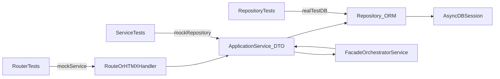

# FastAPI Skill Structure

## Purpose

This document defines how the FastAPI skill is organized and how references must be invoked before implementation.

Use this as the navigation and enforcement map for `SKILL.md` and all docs in `references/`.

FastAPI backend architecture is the primary scope. HTMX guidance is secondary and used when HTMX routes/views are part of the implementation.

## Document Map

- [SKILL.md](SKILL.md): global protocol, mandatory invocation rules, and non-negotiable constraints.
- [references/routes.md](references/routes.md): HTTP translation layer rules.
- [references/htmx.md](references/htmx.md): HTMX route/template/HX-header rules (secondary, optional by scope).
- [references/services.md](references/services.md): business logic and DTO service contract.
- [references/module-isolation.md](references/module-isolation.md): cross-module boundaries and facade rules.
- [references/repositories.md](references/repositories.md): persistence rules and update semantics.
- [references/database-setup.md](references/database-setup.md): engine/session/transaction standards.
- [references/schemas-models.md](references/schemas-models.md): DTO/model responsibilities and update DTO design.
- [references/dependencies.md](references/dependencies.md): DI wiring and transaction boundary composition.
- [references/testing.md](references/testing.md): test architecture and mocking matrix.
- [references/exceptions-enums.md](references/exceptions-enums.md): exception ownership and enum location.
- [references/examples.md](references/examples.md): end-to-end behavior examples.
- [references/templates.md](references/templates.md): reusable scaffolds.

## Mandatory Invocation Matrix

Before implementing, call references based on task type:

- **Route change**
  - Required: [references/routes.md](references/routes.md)
  - Optional secondary: [references/htmx.md](references/htmx.md) when HTMX endpoint/template is used
- **Service change**
  - Required: [references/services.md](references/services.md)
  - Also required: [references/module-isolation.md](references/module-isolation.md) when another module is involved
- **Repository change**
  - Required: [references/repositories.md](references/repositories.md)
  - Also required: [references/database-setup.md](references/database-setup.md) when transaction behavior is relevant
- **Schema/DTO change**
  - Required: [references/schemas-models.md](references/schemas-models.md)
  - Also required: [references/repositories.md](references/repositories.md) for update semantics
- **Dependency/provider change**
  - Required: [references/dependencies.md](references/dependencies.md)
  - Also required: [references/database-setup.md](references/database-setup.md)
- **Test change**
  - Required: [references/testing.md](references/testing.md)
  - Also required: layer doc under test ([references/routes.md](references/routes.md) / [references/services.md](references/services.md) / [references/repositories.md](references/repositories.md))

## Architecture Contracts

### Layering Contract

`route -> service -> repository -> db`

- Routes parse and map transport concerns only. HTMX handlers are a specialized subset for HTMX-driven views/routes.
- Services: business logic and orchestration.
- Repositories: persistence access only.
- `get_db` / session manager: transaction lifecycle only.

### DTO Contract

- Service public methods must receive DTOs and return DTOs.
- Repositories return ORM entities to services.
- Services convert ORM to DTO at boundary.
- Page services return template context made from DTOs/primitives only.

### Module Isolation Contract

- One module cannot call another module's repository directly.
- Cross-module writes/reads go through service public methods.
- Facade/orchestrator services are the approved pattern for multi-module workflows.

### Update Method Contract

- Repository updates must use:
  - `model_dump(exclude_unset=True)`
  - `setattr` loop over provided fields
  - `flush` + `refresh`
- DTO fields with special handling must use `Field(exclude=True)` and be processed in service logic.

### Transaction Contract

- No `commit`/`rollback` in routes/services/repositories.
- Transaction is controlled at dependency/session-manager boundary.

## Test Matrix and DB Interplay

- Router tests mock services (using dependency overrides).
- Service tests mock repositories.
- Repository tests hit real test DB/session fixtures (no DB mocking).
- Root `tests/conftest.py` aggregates module fixtures via `pytest_plugins`.
- Per-module `fixtures.py` keeps dependencies local and explicit.

## Good vs Bad Catalog Index

Reference where examples live:

- URLs and HTMX response patterns: [references/htmx.md](references/htmx.md)
- Service DTO in/out and boundary rules: [references/services.md](references/services.md)
- Update method and excluded fields: [references/repositories.md](references/repositories.md), [references/schemas-models.md](references/schemas-models.md)
- DB creation and transaction control: [references/database-setup.md](references/database-setup.md)
- Test layering and mocking strategy: [references/testing.md](references/testing.md)
- Module coupling vs facade flow: [references/module-isolation.md](references/module-isolation.md)

## System Diagram

